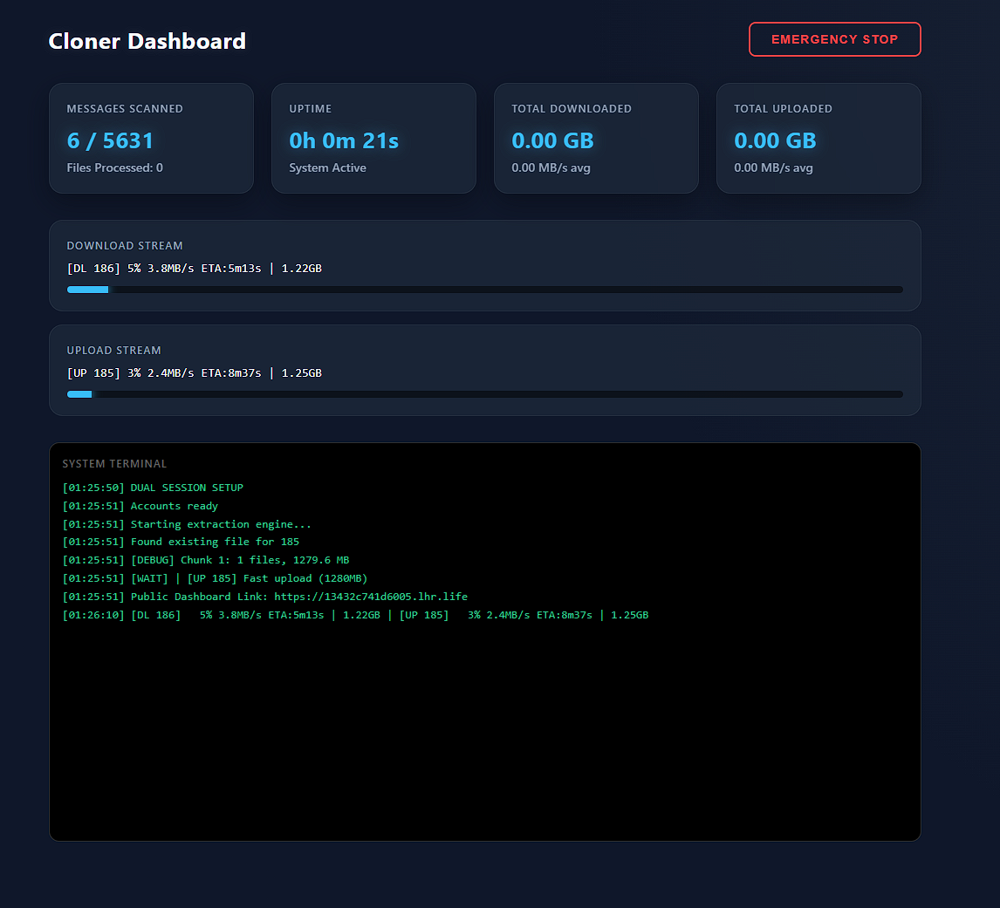

# Telegram Channel Cloner 🚀

A high-performance, asynchronous Telegram channel cloner built with Python and Telethon. Designed for **maximum speed and reliability**, it works perfectly with **restricted channels** where forwarding, saving, or copying content is disabled.

## ✨ Key Features

- **Bypasses All Restrictions** - Clones media/text from private/restricted channels
- **FastTelethon Integration** - Parallel chunked downloads/uploads (up to 23 MB/s)
- **Dual-Account System** - Separate downloader/uploader accounts (reduces FloodWait bans)
- **Live Web Dashboard** - Real-time stats, ETA, speeds, terminal emulation
- **Remote Access** - Automatic public URL via SSH tunnel (monitor from phone)
- **Smart Resume** - Remembers exact message ID, resumes instantly
- **Emergency Stop** - PIN-protected web button (clears queues safely)
- **GIF → Video Conversion** - Animated GIFs become proper videos with thumbnails
- **Smart Thumbnails** - Generated for ALL videos (big/small)
- **Adaptive Anti-Ban** - Exponential backoff + randomized delays

## 🛠️ Prerequisites

- **Python 3.9+**
- **Telegram API credentials** (get from [my.telegram.org](https://my.telegram.org))
- **FFmpeg** (for GIF conversion/thumbnails)

## 🚀 Installation

### Windows (PowerShell/Command Prompt)
```powershell
git clone https://github.com/gaprj/TelegramChannelCloner.git
cd TelegramChannelCloner
pip install -r requirements.txt
```

### Termux (Android)
```bash
pkg update && pkg upgrade
pkg install python git ffmpeg
git clone https://github.com/gaprj/TelegramChannelCloner.git
cd TelegramChannelCloner
pip install -r requirements.txt
```

### Linux/macOS
```bash
git clone https://github.com/gaprj/TelegramChannelCloner.git
cd TelegramChannelCloner
pip install -r requirements.txt
sudo apt install ffmpeg  # Ubuntu/Debian
# or
brew install ffmpeg      # macOS
```

## ⚙️ Configuration

1. **Edit `config.ini`:**
   ```ini
   [API]
   ID = YOUR_API_ID
   HASH = YOUR_API_HASH

   [CHATS]
   SOURCE = -1000000000000  # Get it from chat_finder.py
   DEST   = -1000000000000

   [ACCOUNT]
   USE_DUAL_ACCOUNT = True

   [SETTINGS]
   FILE_DELAY_MIN = 2.0
   FILE_DELAY_MAX = 4.0
   BLOCK_DELAY_MIN = 6.0
   BLOCK_DELAY_MAX = 12.0
   FAST_THRESHOLD_MB = 10.0
   MAX_STANDARD_MB = 1950.0
   MAX_PREMIUM_MB = 3950.0

   [WEB]
   PIN = 1234  # PIN for Emergency Stop
   ```

2. **Run login helper:**
   ```bash
   python chat_finder.py
   ```
   → It shows all your channels/groups with their exact numeric IDs.

## 🎮 Usage

```bash
python main.py
```

**On first startup you'll see:**
```
🔗 Local: http://0.0.0.0:5000
🔗 Public: https://xxxxxx.lhr.life
```

**Dashboard shows:**
- Live DL/UL speeds
- Processed / total files
- Estimated ETA
- Terminal emulation
- Emergency Stop (PIN-protected)

## 📱 Mobile Access

1. Start python main.py
2. Copy the public URL (https://xxxx.lhr.life)
3. Open it in your phone's browser
4. Monitor everything remotely

## 🔧 Advanced Options (config.ini)

```
[PERFORMANCE]
fast_threshold_mb = 25     # Videos >25MB use FastTelethon
file_delay_min    = 2.0    # Delay between downloads (sec)
file_delay_max    = 4.0
block_delay_min   = 6.0    # Delay between album blocks
block_delay_max   = 12.0

[WEB]
port = 5000                # Local port
```

## 🛡️ Anti-Ban Features

- **Dual accounts** → Distributed load
- **Adaptive FloodWait** → Increasing backoff (x1.5, x2, x3...)
- **File reference refresh** → Re-fetches messages for fresh references
- **Smart retry limits** → Max 3 attempts per file
- **Random delays** → Avoids predictable request patterns

## 📁 File Structure

```
TelegramChannelCloner/
├── main.py                 # Main script
├── chat_finder.py          # Helper to find channel IDs
├── config.ini             # Configuration (copy from example)
├── requirements.txt        # Dependencies
├── media/                 # Downloaded files (auto-cleanup)
├── debug_gif.txt          # GIF conversion logs
├── errori.txt             # Telegram error logs
└── stats.txt              # Final statistics
```

## 🐛 Troubleshooting

**"File reference expired" →** Normal after ~1h. The auto re-fetch handles it.

**"FloodWait 1500s" →** Adaptive anti-ban in action. Wait it out, don't interrupt.

**"ffmpeg not found" →** 
```bash
# Windows: download from ffmpeg.org, add to PATH
# Termux: pkg install ffmpeg
# Ubuntu: sudo apt install ffmpeg
```

**Perma-Ban →** Use secondary accounts, wait 24h.

## 📈 Screenshots



## 📝 Technical Notes & Performance

Read the operational notes, hardware recommendations, and stress-test benchmarks here:
[Telegraph: Technical Notes & Observations](https://telegra.ph/Telegram-Channel-Cloner-Technical-Notes--Observations-03-16)

## 🤝 Credits

- Special thanks to [painor for the original FastTelethon snippet](https://gist.github.com/painor/7e74de80ae0c819d3e9abcf9989a8dd6), which provides the core parallel chunking logic that makes the extreme download and upload speeds of this bot possible.

